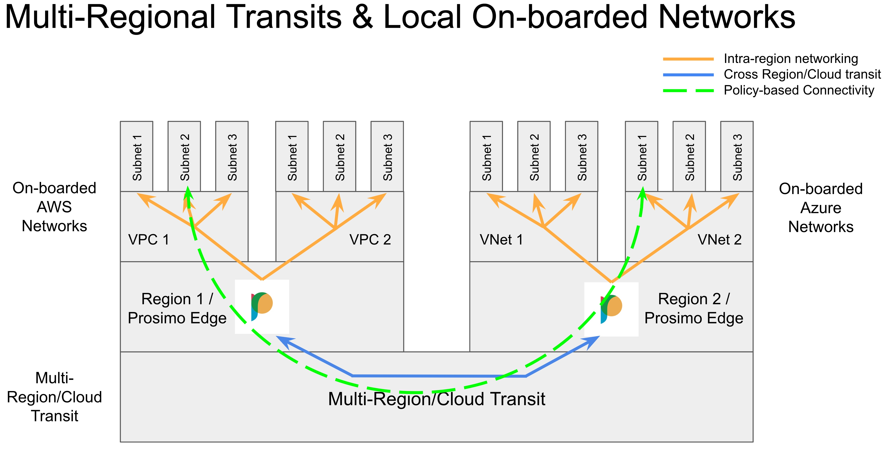
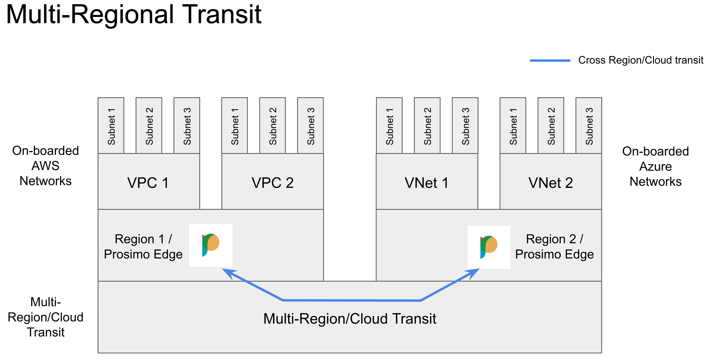
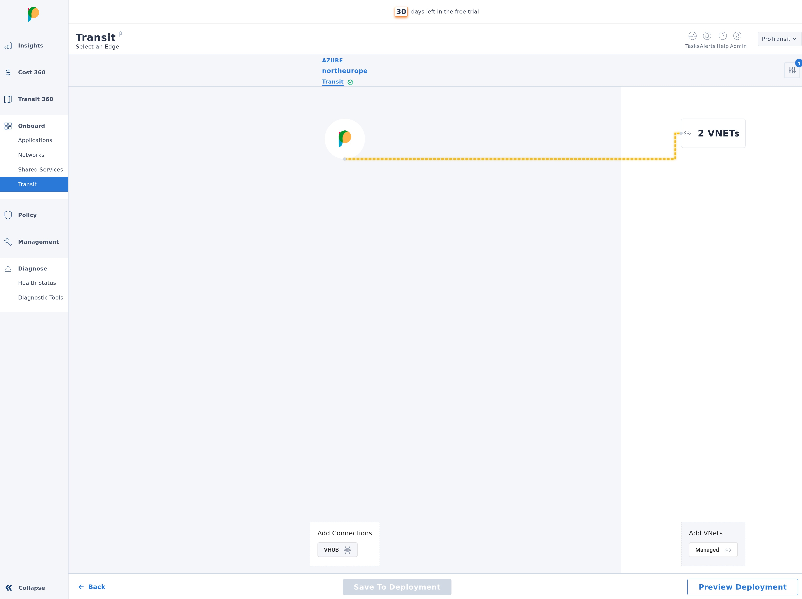
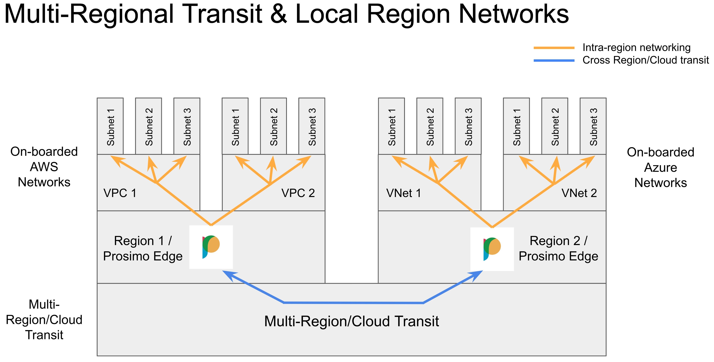
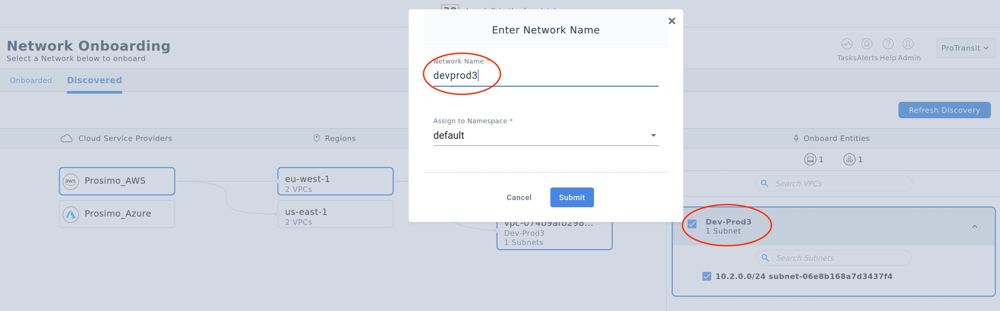
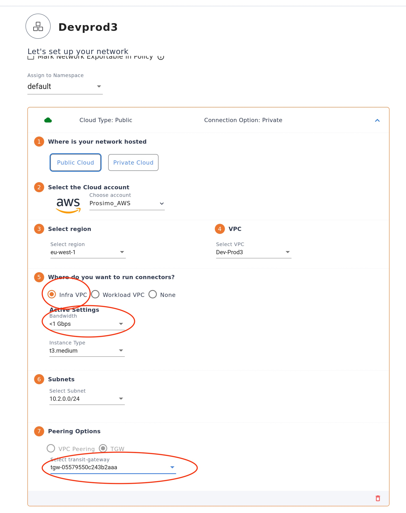
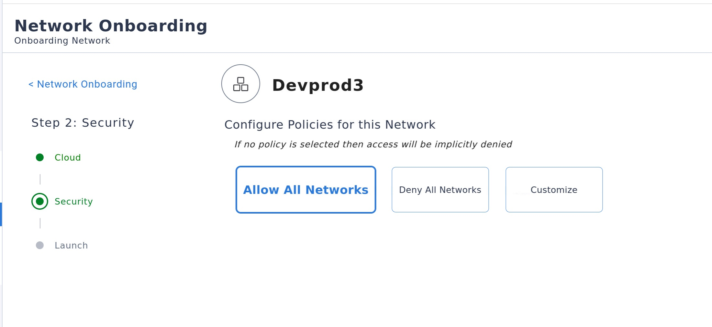
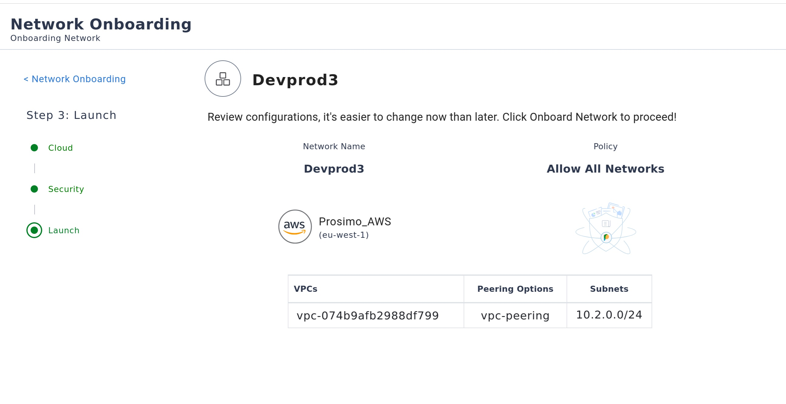
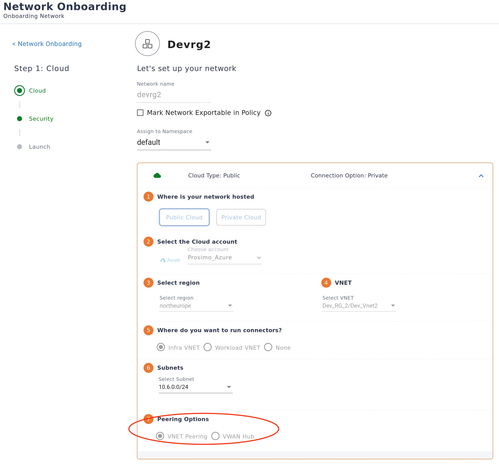

In this challenge we will on-board existing cloud network to Prosimo for management. We shall then create multi-cloud interconnectivity between these networks - across clouds, regions, and geographies.

1) Build multi-region, multi-cloud transits
2) On-boarding region networks
3) Verify the transit connectivity

Before we begin, here's a quick introduction to the concepts of Prosimo Transits and Prosimo Networks:


Below we shall first create a Prosimo Transit (the blue lines in the diagram), then we shall onboard the VPC/VNet networks (the orange lines).

# 1) Build Multi-Region/Cloud Transit
===



In this secion we will:
* Attach an existing AWS Transit Gateway to the in-region Prosimo Network Edge - `AWS/eu-west-1`
* Have Prosimo deploy a new Transit Gateway, configure it, and attach it to the regions Network Edge - `AWS/us-east-1`
* Peer VNets directly to their regions Network Edge - `Azure/northerneurope`

Swith to the 'Prosimo' tab, and follow the steps below:

---

## Build Transit for an Existing TGW/Networks:

1) In the left-hand navgation pane, in the "Onboard" section, select "Transit".
2) Click the blue cirlce with the number '2' in it to zoom into that region.
3) Select the "AWS eu-west-1" Edge icon, then click the blue button, located at the bottom of the screen, labelled "Let's start building transit".
4) Select/Click the Prosimo Edge already deployed in this region (the Prosimo logo).
5) Now click the AWS Transit Gateway (TGW). An orange dashed line should appear, representing the new connection.
6) Next click "Add VPCs" - bottom right corner. You should see a list of discovered VPCs and Subnets for this region appear in the right-hand pane.
7) Click the checkbox next to the account name (top of the list) to automatically select all VPCs.
8) Now click on the "Add VPC's" button
9) Click on the TGW
10) Click on the "2 VPCs" icon - a dashed orange line should appear between then two.
11) Click "Save to Deployment"
12) Click "Preview Deployment" - bottom right.
13) Select the new configuration and click "Review & Deploy"
 You should now see your changes listed in the "Edited" section. It should resemble something like this: `tgw-072dd16ccd3248cc3 - connected to 2 VPCs and Infra Edge`
14) Click "Proceed". The configuration status should now read "Deploying"

Review the deployment:

1) Click the 'Tasks' button - top right corner.
2) Select the "In Progress" task at the top of the list and click the "View" button.

You are now watching Prosimo's orchestration of cloud-native network resources, including:

* Creation and attacment of Route Tables for each VPC/Network to TGW.
* Attachment of Transit Gateway to Prosimo's Secure Multi-Cloud Mesh

Verify change:
1) In the left-hand pane, click "Management" then click the "Edges" tile.
2) Select the region we just modified above - "AWS/eu-west-1", and click "View/Edit".

NOTE: "Conenctions" is no longer "0"

3) Click on "Connections"
4) Click the "Transit Gateway" tab. You can see the transit gateway is now attacned to our Prosimo Edge deployed in that region.

You have now connected the `AWS/eu-west-1` region to the Prosimo Mesh.

---

## Build Transit and orchestrate new Transit Gateway (TGW):

Repeat the steps above (1 - 14) for the `AWS/us-east-1` region, but this time create a new Transit Gateway (TGW) by clicking "Add Connections: TGW" at the bottom of the screen. Name it "TGW", and select the AWS account from list.

---

## Build Transit by peering networks directly with Prosimo Edge:

Finally we shall now connect the `Azure/northerneurope` region to its Prosimo Edge, but this time we shall peer the VNets directly, as showin the following diagram.



---

NOTE: Before progressing to the next section ensure that the Transit onboarding has complete by monitoring the deployment tasks. To review the deployment:

* Click the 'Tasks' button - top right corner.
* Select the "In Progress" tasks at the top of the list and click the "View" button.

Once you have completed attaching all three regions to their Prosimo Edges you may proceed to the next section: **On-boarding Networks**


# 2) Onboard Cloud-Region Networks
===



Now we shall on-board specific networks for Prosimo management (orange lines above).

In this section we will create Prosimo Networks – a Prosimo construct comprising of a collection of subnets across any number of VPCs or VNets, across any number of regions, within a common Cloud Account. A single Prosimo Network may not span two Cloud Accounts.

First we shall onboard the 'Dev' networks.

| *Region* | *Dev Network* |
|-----------|------------|
| `eu-west-1` | `WebSvcsDevEu` |
| `us-east-1` | `WebSvcsDevUs` |
| `Azure/northerneurope` | `AppSvcsDevEu` |


Switch to the Prismo tab and proceed with the instructions below:

1) In the left-hand pane, under "Onbaord", click "Networks".
2) Select the "Discovered" tab.
3) Under Cloud Service Providers, click "Prosimo_AWS".
4) Under regions, select `eu-west-1`.
5) Under VPCs, select `WebSvcsDevEu`.
6) In the "Onboard Entities" box to the right, check the box next to each VPC name to select all of the VPCs subnets.
7) Click the "Onboard" button at the bottom-right of the screen.
8) Give this Prosimo Network a name (**NOTE**: Follow the naming convention from the LAB diagram.) and leave the Namespace as 'default'.
9) The "Proceed"




Next we shall provide some parameters for this newly created Prosimo Network.

10) For the prompt "Where do you want to run connectors?", select "Infra VPC".
11) For "Bandwidth" select "< 1Gbps".
12) In peering optiond, select the TGW.
13) Click "Proceed".




Now we shall configure the "Security" settings for this new Prosimo Network.

14) For the prompt "Configure Policies for this Network", select "Allow All Networks".
15) Click Proceed.




16) Lastly, we shall review and confirm the options, and then deploy the new Prosimo Network by clicking "Onboard".



Repeat the steps above for each of the 'Dev' VPCs/VNets in the other regions/clouds.

**NOTE:** While on-boarding the networks you can observe their progress via a) the Prosimo Dashboard 'Onboarded' tab, or b) the Prosimo 'Tasks' button (top right).

**NOTE:** The Azure network onboarding options are slightly different as we are using VNet Peering:



---

Upon completing the on-boarding of the 'Dev' networks, you may now on-board the 'Prod' networks using the same steps outlined above:

| *Region* | *Prod Network* |
|-----------|------------|
| `eu-west-1` | `WebSvcsProdEu` |
| `us-east-1` | `WebSvcsProdUs` |
| `Azure/northerneurope` | `AppSvcsProdEu` |

---

With all networks now onboarded you may proceed to the section below.


# 3) Verify the transit connectivity
===

Now we shall verify the connectivity across these newly paved networks.

Review the `Lab Diagram`. We are now going to verify connectivity from each of the 'Front End Web Services' virtual machines through to the 'App Services' virtual machines.

1) First we must set safe permissions for the PEM format keys, using the following commands:

```sh
cd assets/terraform/
chmod 400 *.pem
```

2) Next we need to get the credentials for our Lab Servers, so that we can remote shell into them:

```sh
terraform output
```

You should see something like this (but with different IP Addresses):

```
ssh_access_aws_eu = [
  "WebServerProdEu1 - 10.4.0.100 => ssh -i '~/prosimo-lab/assets/terraform/EU_WEST_WebSvcsProd.pem' ec2-user@52.211.200.131",
  "WebServerDevEu1 - 10.5.0.100 => ssh -i '~/prosimo-lab/assets/terraform/EU_WEST_WebSvcsDev.pem' ec2-user@52.214.0.51",
]
ssh_access_aws_us = [
  "WebServerProdUs1 - 10.2.0.100 => ssh -i '~/prosimo-lab/assets/terraform/US_EAST_WebSvcsProd.pem' ec2-user@54.162.135.145",
  "WebServerDevUs1 - 10.3.0.100 => ssh -i '~/prosimo-lab/assets/terraform/US_EAST_WebSvcsDev.pem' ec2-user@107.21.232.146",
]
ssh_access_azure_eu = [
  "AppSvcsProdEu - 10.0.0.100 =>  ssh -i '~/prosimo-lab/assets/terraform/Azure_Srv1.pem' linuxuser@98.71.85.11",
  "AppSvcsDevEu - 10.1.0.100 =>  ssh -i '~/prosimo-lab/assets/terraform/Azure_Srv2.pem' linuxuser@98.71.84.253",
]
```

*NOTE* the format of each entry:  <Virtual_Server_Name> - <private_ip_address> => <ssh_command>

3) Verify that each `Server Name` and `Private IP Address` maps to those in the Lab Diagram.
4) Starting with `WebServerProdEu1`, use the ssh command provided in the terraform output to remote shell into `WebServerProdEu1`,
5) Ensure you can send an ICMP packet from this server to `AppSvcsProdEu` with the following command:

```
ping -c 4 10.0.0.100
```

5) Verify you have communication to the `AppSvcsProdEu` HTTP servers with the following command:

```sh
/home/ec2-user/traffic.sh test http://10.0.0.100
```

You should see something like:
```sh
[ec2-user@ip-10-4-0-100 ~]$ /home/ec2-user/traffic.sh test http://10.0.0.100
The counter is 1 of 2
“Hello Prosimo MCN fans and Welcome”
The counter is 2 of 2
“Hello Prosimo MCN fans and Welcome”
```

6) Now lets set this script running in the background to generate some network traffic across the environment:

```sh
/home/ec2-user/traffic.sh 2000 http://10.0.0.100 &
```

*NOTE:* you will see no output from the command above. It is running silently as a background process.

Repeat the above steps verifying each of the "Web Front End" server can reach their "App Services" backend, as follows:

| *Front End Web Svc* | *App Svc* |
|-----------|------------|
| `WebSvcsProdEu1` > | `AppSvcsProdEu` - 10.0.0.100 |
| `WebSvcsProdUs1` > | `AppSvcsProdEu` - 10.0.0.100 |
| `WebSvcsDevEu1` > | `AppSvcsDevEu` - 10.1.0.100 |
| `WebSvcsDevUs1` > | `AppSvcsDevEu` - 10.1.0.100 |


For the **Prod** Front End Servers, run:
```sh
/home/ec2-user/traffic.sh 2000 http://10.0.0.100 &
```

For the **Dev** Front End Servers, run:
```sh
/home/ec2-user/traffic.sh 2000 http://10.1.0.100 &
```


This concludes the Building Multi-Cloud Transit sesssion. You may now click the green 'Check' button located at the bottom-right of the screen.


# Cloud Account Credentials (if needed)
===

In case you need to login again, the cloud platform credentials are below:

Using the credentials below, login to the AWS and Azure Web Consoles in their respective tabs above:

---
# AWS Credentials ☁️

Select "IAM Account" and enter the **AWS ID**:
```
[[ Instruqt-Var key="INSTRUQT_AWS_ACCOUNT_PROSIMO_DEMO_ACCOUNT_ID" hostname="shell" ]]
```

**AWS Username**
```
[[ Instruqt-Var key="INSTRUQT_AWS_ACCOUNT_PROSIMO_DEMO_USERNAME" hostname="shell" ]]
```

**AWS Password**
```
[[ Instruqt-Var key="INSTRUQT_AWS_ACCOUNT_PROSIMO_DEMO_PASSWORD" hostname="shell" ]]
```

---

# AZURE Credentials ☁️

**AZURE SUBSCRIPTION**
```
[[ Instruqt-Var key="INSTRUQT_AZURE_SUBSCRIPTION_PROSIMO_TENANT_SUBSCRIPTION_ID" hostname="shell" ]]
```

**AZURE USERNAME**
```
[[ Instruqt-Var key="INSTRUQT_AZURE_SUBSCRIPTION_PROSIMO_TENANT_USERNAME" hostname="shell" ]]
```

**AZURE PASSWORD**
```
[[ Instruqt-Var key="INSTRUQT_AZURE_SUBSCRIPTION_PROSIMO_TENANT_PASSWORD" hostname="shell" ]]
```


