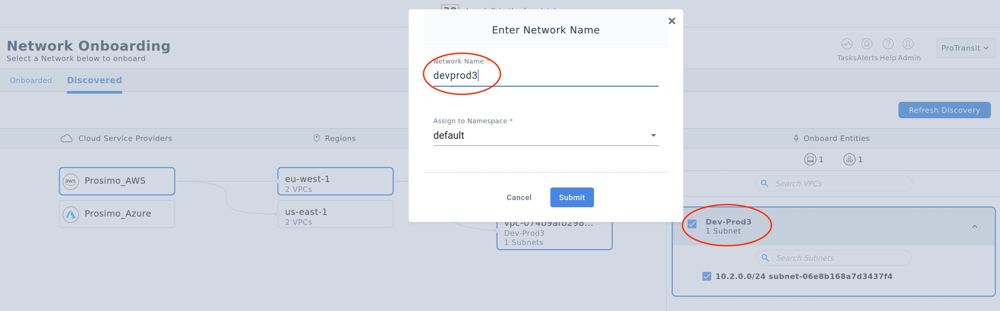
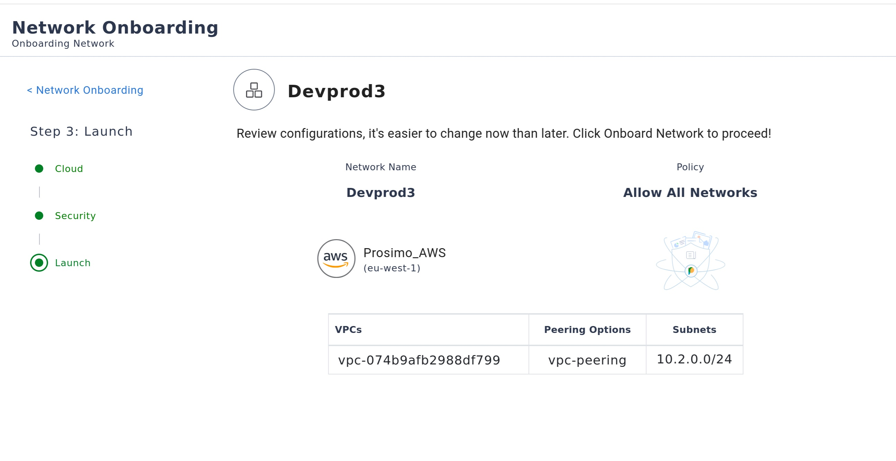

In this challenge we will on-board existing cloud network to Prosimo for management. We shall then create multi-cloud interconnectivity between these networks - across clouds, regions, and geographies.

1) Build multi-region, multi-cloud transits
2) On-boarding region networks
3) Verify the transit connectivity

Before we begin, here's a quick introduction to the concepts of Prosimo Transits and Prosimo Networks:


Below we shall first create a Prosimo Transit (the blue lines in the diagram), then we shall onboard the VPC/VNet networks (the orange lines).

# 1) Build Multi-Region/Cloud Transit
===


In this secion we will attach an existing Transit Gateway to the in-region Prosimo Network Edge. The Network Edges for the 'Prosimo Mesh', which facilitates multi-region and multi-cloud connectivity.

1) In the left-hand navgation pane, in the "Onboard" section, select "Transit".
2) Click the blue cirlce with the numder '2' in it to zoom into that region.
3) Select the "AWS eu-west-1" Edge icon, then click the blue button, located at the bottom of the screen, labelled "Let's start building transit".

NOTE: If one wasn't already deployed, you would now be prompted to select an on-boarded Cloud Account and deploy new Edge into that region. However, to save time, we have pre-provisioned your network Edges for you.

4) Select/Click the Prosimo Edge already deployed in this region (the Prosimo logo).
5) Now click the AWS Transit Gateway (TGW). An orange dashed line should appear, representing the new connection.
6) Click "Save to Deployment" at the bottom of the screen.


7) Next click "Add VPCs" - bottom right corner. You should see a list of discovered VPCs and Subnets for this region appear in the right-hand pane.
8) Click the checkbox next to the account name (top of the list) to automatically select all VPCs.
9) Now click on the "Add VPC's" button

Connect the VPCs to the already connected TGW:
1) Click on the "Dev" TGW
2) Click on the "2 VPCs" icon - a dashed orange line should appear between then two.
9) Click "Save to Deployment"
10) Click "Preview Deployment" - bottom right.
11) Select the new configuration and click "Review & Deploy"
 You should now see your changes listed in the "Edited" section. It should resemble something like this: `tgw-072dd16ccd3248cc3 - connected to 2 VPCs and Infra Edge`
12) Click "Proceed". The configuration status should now read "Deploying"

Review the deployment:

1) Click the 'Tasks' button - top right corner.
2) Select the "In Progress" task at the top of the list and click the "View" button.

You are now watching Prosimo's orchestration of cloud-native network resources, including:

* Creation and attacment of Route Tables for each VPC/Network to TGW.
* Attachment of Transit Gateway to Prosimo's Secure Multi-Cloud Mesh

NOTE: on-going management of routes and attachments, as networks are discovered, on-boarded, or removed, are orchestrated by Prosimo. Manual Cloud Natvie resource managment is no longer inhibiting business objectives.

Verify change:
1) In the left-hand pane, click "Management" then click the "Edges" tile.
2) Select the region we just modified above - "AWS/eu-west-1", and click "View/Edit".

NOTE: "Conenctions" is no longer "0"

3) Click on "Connections"
4) Click the "Transit Gateway" tab. You can see the transit gateway is now attacned to our Prosimo Edge deployed in that region.


You have now connected the `AWS/eu-west-1` region to the Prosimo Mesh. Before proceeding to the next section you must perform these same steps for the remaining two regions: `AWS/us-east-1` and `Azure/northerneurope`

**NOTE:** For `AWS/us-east-1` you will be creating a new TGW by click "Add TGW" at the bottom of the screen.

**NOTE:** For `Azure/northerneurope` you will not be creating a new TGW, because that is an AWS contstruct which doesn't exist on Azure. The alternate Azure construct is called a 'Virtual Hub', however, instead you will use VNet Peering. Don't click on the VHUB icon at the bottom, instead attach the Prosimo Edge directly to the VNet, as showin the following diagram.


Once you have completed attaching all three regions to their Prosimo Edges you may proceed to the next section: **On-boarding Networks**


# 2) Onboard Cloud-Region Networks
===


Now we shall on-board specific networks for Prosimo management (orange lines above).

In this section we will create Prosimo Networks – a Prosimo construct comprising of a collection of subnets across any number of VPCs or VNets, across any number of regions, within a common Cloud Account. A single Prosimo Network may not span two Cloud Accounts.

Switch to the Prismo tab and proceed with the instructions below:

1) In the left-hand pane, under "Onbaord", click "Networks".
2) Select the "Discovered" tab.
3) Under Cloud Service Providers, click "Prosimo_AWS".
4) Under regions, select the first in the list.
5) Under VPCs, select both VPCs in the list.
6) In the "Onboard Entities" box to the right, check the box next to each VPC name to select all of the VPCs subnets.
7) Click the "Onboard" button at the bottom-right of the screen.
8) Give this Prosimo Network a name (**NOTE**: Follow the naming convention from the LAB diagram.) and leave the Namespace as 'default'.
9) The "Proceed"




Next we shall provide some parameters for this newly created Prosimo Network.

1) For the prompt "Where do you want to run connectors?", select "Infra VPC".
2) For "Bandwidth" select "< 1Gbps".
3) For "Service Insertion Endpoint", select "None".
4) Click "Proceed".


Now we shall configure the "Security" settings for this new Prosimo Network.

1) For the prompt "Configure Policies for this Network", select "Allow All Networks".
2) Click Proceed.


Lastly, we shall review and confirm the options, and then deploy the new Prosimo Network by clicking "Onboard".




While it may not be neccessary in a production environment, to successfully complete this lab you will need to onboard all of the networks (there aren't many). **NOTE**: Repeat these steps for each of the VPCs/VNets for each Cloud Provider.


**NOTE:** The Azure network onboarding options are slightly different as we are using VNet Peering:


# 3) Verify the transit connectivity
===

Now we shall verify the connectivuty across these newly paved networks.

First we must set safe permissions for the PEM format keys, using the following commands:
```sh
cd assets/terraform/
chmod 400 *.pem
```

Now we need to get the External IP Addresses of our Lab Server, so that we can remote shell to them:

```sh
terraform output
```

You should see something like this:

```
aws_ec2_public_ip_eu = [
  "52.30.57.126",
  "52.211.75.24",
]
aws_ec2_public_ip_us = [
  "18.211.128.236",
  "44.219.179.223",
]
azure_vm_public_ip_eu = [
  "4.231.229.19",
  "4.210.104.226",
]
prosimo_cloud_nickname = "Prosimo_AWS"
```

Using these address, and the PEM keys, connect to the servers:

```sh
ssh -i  "$ssh_pem_file"  ec2-user@$Public_IP_Webserver
```

This concludes the Building Multi-Cloud Transit sesssion. You may now click the green 'Check' button located at the bottom-right of the screen.


# Cloud Account Credentials (if needed)
===

In case you need to login again, the cloud platform credentials are below:

Using the credentials below, login to the AWS and Azure Web Consoles in their respective tabs above:

---
# AWS Credentials ☁️

Select "IAM Account" and enter the **AWS ID**:
```
[[ Instruqt-Var key="INSTRUQT_AWS_ACCOUNT_PROSIMO_DEMO_ACCOUNT_ID" hostname="shell" ]]
```

**AWS Username**
```
[[ Instruqt-Var key="INSTRUQT_AWS_ACCOUNT_PROSIMO_DEMO_USERNAME" hostname="shell" ]]
```

**AWS Password**
```
[[ Instruqt-Var key="INSTRUQT_AWS_ACCOUNT_PROSIMO_DEMO_PASSWORD" hostname="shell" ]]
```

---

# AZURE Credentials ☁️

**AZURE SUBSCRIPTION**
```
[[ Instruqt-Var key="INSTRUQT_AZURE_SUBSCRIPTION_PROSIMO_TENANT_SUBSCRIPTION_ID" hostname="shell" ]]
```

**AZURE USERNAME**
```
[[ Instruqt-Var key="INSTRUQT_AZURE_SUBSCRIPTION_PROSIMO_TENANT_USERNAME" hostname="shell" ]]
```

**AZURE PASSWORD**
```
[[ Instruqt-Var key="INSTRUQT_AZURE_SUBSCRIPTION_PROSIMO_TENANT_PASSWORD" hostname="shell" ]]
```


